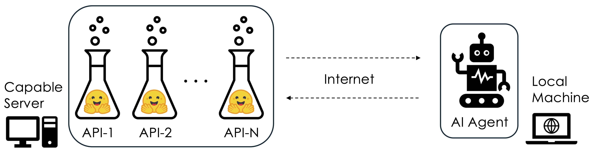

# Adding tools to Agent252D
<br>
We will elicit tool use in our agent via inference-time prompting, similar to VisProg. This requires first creating a tool template which contains necessary information about the tool, such as its name, description, parameters and usage patterns. 

```python
class Tool:
    def __init__(self, 
                 name, 
                 role, 
                 io,
                 demo=None):
        '''
        Template for a tool.

        name: str - name of the tool
        role: str - role of the tool
        io: str - role of the input and output format
        demo: str - demo of the tool usage
        '''
        self.name = name
        self.role = role
        self.io = io
        self.demo = demo

    def __call__(self, *args, **kwargs):
        '''
        Call the tool with the given arguments.
        '''
        pass

    def _output_response(self, response):
        with open("tmp/log.txt", "a") as f:
            f.write(f"{self.name}: {response}\n")
```

Any utility can then be turned into a function by inheriting from the `Tool` class and specifying its name, role, input and output format and a demo of its usage. For example, the following program shows an example of a calculator tool that can be used to perform basic arithmetic operations. 
```python
class CalculatorTool(Tool):
    def __init__(self):
        name = "CalculatorTool"
        role = "A tool to perform calculations."
        io = """
num1: float - first number
num2: float - second number
operation: str - operation to perform. one of ['+', '-', '*', '/']
Output: float - result of the operation
"""
        demo = """
toolkit.CalculatorTool(1, 2, '+') --> 3
toolkit.CalculatorTool(1, 2, '-') --> -1
toolkit.CalculatorTool(1, 2, '*') --> 2
toolkit.CalculatorTool(1, 2, '/') --> 0.5
"""
        super().__init__(name, role, io, demo)

    def __call__(self, num1, num2, operation):
        '''
        Perform the calculation.
        '''
        # raise NotImplementedError("Calculator is not implemented yet.")
        if operation == '+':
            resut = num1 + num2
        elif operation == '-': 
            resut = num1 - num2
        elif operation == '*':
            resut = num1 * num2
        elif operation == '/':
            resut = num1 / num2
        else:
            raise ValueError(f"Unknown operation: {operation}")
        
        self._output_response(f"{num1} {operation} {num2} = {resut}")
        return resut
```

A search tool can be created in a similar way using the SerpAPI.

```python
class SearchTool(Tool):
    def __init__(self):
        name = "SearchTool"
        role = "A tool to search for information."
        io = """
Input: A query string
Output: A string containing the search results.
"""
        demo = """
Query: What is the capital of France?
Usage: toolkit.SearchTool("What is the capital of France?") --> "The capital of France is Paris."
"""
        super().__init__(name, role, io, demo)
    
    def __call__(self, query):
        from langchain_community.utilities import SerpAPIWrapper
        search = SerpAPIWrapper(serpapi_api_key=os.getenv("SERPAPI_API_KEY"))
        results = search.run(query)
        self._output_response(f"Search results for '{query}': {results}")
        return results
```

A toolkit serves to accumulate the tools and provide appropriate context to the agent to ensure correct tool usage. Various tools can simply be registered with a toolkit. 
```python
class Toolkit:
    def __init__(self):
        self.tools_context = ""

    def register_tool(self, tool):
        self.tools_context += f"""
Tool Name: {tool.name}
Tool Description: {tool.role}
Tool Input/Output: {tool.io}
Tool Demo: {tool.demo}
"""
        setattr(self, tool.name, self._make_callable(tool))
        # Dynamically bind tools as instance methods

    def _make_callable(self, tool):
        def call_tool(*args, **kwargs):
            return tool(*args, **kwargs)
        return call_tool
    
    def get_context(self):
        '''
        Get the context of the tools.
        '''
        return self.tools_context

toolkit = Toolkit()
toolkit.register_tool(SearchTool())
toolkit.register_tool(CalculatorTool())

print(toolkit.get_context())

# >> Tool Name: SearchTool
# Tool Description: A tool to search for information.
# Tool Input/Output: 
# Input: A query string
# Output: A string containing the search results.

# Tool Demo: 
# Query: What is the capital of France?
# Usage: toolkit.SearchTool("What is the capital of France?") --> "The capital of France is Paris."

# Tool Name: CalculatorTool
# Tool Description: A tool to perform calculations.
# Tool Input/Output: 
# num1: float - first number
# num2: float - second number
# operation: str - operation to perform. one of ['+', '-', '*', '/']
# Output: float - result of the operation

# Tool Demo: 
# toolkit.CalculatorTool(1, 2, '+') --> 3
# toolkit.CalculatorTool(1, 2, '-') --> -1
# toolkit.CalculatorTool(1, 2, '*') --> 2
# toolkit.CalculatorTool(1, 2, '/') --> 0.5
```

A key differentiator of tool use is that now the agent will execute the tools with the help of an intepreter, and not merely return text responses. This is achieved by updating the agent core. 
```python
class AgentCoreWithToolUse(AgentCoreBase):
    def __init__(self, name, role):
        '''
        Implementation of Agent252D
        name: str - name of the agent
        role: str - role of the agent
        '''

        super().__init__(name, role)
        
        ## LLM to check 
        self.synthesizer = LLM(
            name=self.name+'_agentCore',
            system_desc=f"""
You are a helpful AI agent named {self.name}. Your role is {self.role}.
You are supposed to assist the user in achieving their goals.
You will be writing a program in Python which may use the provided tools to help complete the task.
Note that toolkit is already imported in the code, so you can use it directly. Absolutely, do not try to import any packages in the code.
""",
            response_format="code",
        )
        self.exec = CodeExecutor(name=self.name+'_executor')
    
    def __call__(self, input):
        code = self.synthesizer(input)
        response = self.exec(code)
        return response, code

```

Lastly, we will modify the `build_context` of Agent252D to include the toolkit context. 
```python
class Agent252DWithToolUse(Agent252DWithMemory):
    def __init__(self, name, role):
        '''
        Implementation of Agent252D
        name: str - name of the agent
        role: str - role of the agent
        '''

        super().__init__(name, role)

        self.toolkit = toolkit

    def build_context(self, user_input):
        context = self.chat_history.fetch()

        ## Uncomment for memory and RAG use
        retrieved_context = self.semantic_memory.fetch(user_input)
        tool_context = self.toolkit.get_context()
        context = f"""
Interaction history:
{context}
Use the following context to answer the user's query.
{retrieved_context}
Following tools can be used by you.
{tool_context}
"""
        return context
```

---
Let's give it a try! 

```python
from agent import Agent252DWithToolUse
agent1 = Agent252DWithToolUse(name="Agent252D", role="a helpful assistant")
agent1("What is the age of leonardo dicaprio's current girlfriend divided by 2?", caller="User")

# >> Agent252D: Leonardo DiCaprio's current girlfriend is 26 years old. 
# Her age divided by 2 is 13.
```

Awesome! If we look at the code which our agent wrote to get this answer, we can see that it used a combination of calculator and search tools. 

```python
# Use the SearchTool to find out the age of Leonardo DiCaprio's current girlfriend.
search_result = toolkit.SearchTool("What is the age of Leonardo DiCaprio's current girlfriend?")

# Here, I will assume that the search result is a string containing the age. 
# For a more comprehensive solution, parsing the search_result would be necessary.

# Extract the age from the search result. This is a placeholder for actual extraction logic.
import re

def extract_age(text):
    # A simple regex to find the first number in the text, assuming it is the age.
    match = re.search(r'\d+', text)
    return int(match.group()) if match else None

age = extract_age(search_result)

# If age is found, divide it by 2 using the CalculatorTool.
if age is not None:
    half_age = toolkit.CalculatorTool(age, 2, '/')
    half_age
else:
    "Age information not found in the search result."

```

---

## Adding advanced tools

While it is fun to create simple tools, we are going to need some serious tools, such as deep learning models, to make our agent useful. We will use huggingface transformers to create such tools and use flask to serve them on a capable machine. Then our agent (running locally) will be able to call these tools over the network. 

<br>
<p style="text-align: center;">
  
</p>
<br>

Let's take a look at how to create an object detection tool using huggingface's <href="https://huggingface.co/docs/transformers/en/model_doc/owlvit">OWL-ViT</href> model. This is what the documentation says:

```python
import requests
from PIL import Image
import torch

from transformers import OwlViTProcessor, OwlViTForObjectDetection

processor = OwlViTProcessor.from_pretrained("google/owlvit-base-patch32")
model = OwlViTForObjectDetection.from_pretrained("google/owlvit-base-patch32")

url = "http://images.cocodataset.org/val2017/000000039769.jpg"
image = Image.open(requests.get(url, stream=True).raw)
text_labels = [["a photo of a cat", "a photo of a dog"]]
inputs = processor(text=text_labels, images=image, return_tensors="pt")
outputs = model(**inputs)

# Target image sizes (height, width) to rescale box predictions [batch_size, 2]
target_sizes = torch.tensor([(image.height, image.width)])
# Convert outputs (bounding boxes and class logits) to Pascal VOC format (xmin, ymin, xmax, ymax)
results = processor.post_process_grounded_object_detection(
    outputs=outputs, target_sizes=target_sizes, threshold=0.1, text_labels=text_labels
)
# Retrieve predictions for the first image for the corresponding text queries
result = results[0]
boxes, scores, text_labels = result["boxes"], result["scores"], result["text_labels"]
for box, score, text_label in zip(boxes, scores, text_labels):
    box = [round(i, 2) for i in box.tolist()]
    print(f"Detected {text_label} with confidence {round(score.item(), 3)} at location {box}")
    
```
We can then create server side and client side code to serve this model. *Hint: I used ChatGPT to generate the respective codes.* 

Server side code:
```python
import torch
from flask import Flask, request, jsonify
from PIL import Image
from transformers import OwlViTProcessor, OwlViTForObjectDetection

# Initialize model
class OwlVitZeroShotDetector:
    def __init__(self, threshold=0.1):
        self.processor = OwlViTProcessor.from_pretrained("google/owlvit-base-patch32")
        self.model = OwlViTForObjectDetection.from_pretrained("google/owlvit-base-patch32")
        self.threshold = threshold

    def detect(self, image: Image.Image, text_labels):
        inputs = self.processor(text=[text_labels], images=image, return_tensors="pt")
        outputs = self.model(**inputs)

        target_sizes = torch.tensor([(image.height, image.width)])
        results = self.processor.post_process_grounded_object_detection(
            outputs=outputs,
            target_sizes=target_sizes,
            threshold=self.threshold,
            text_labels=[text_labels]
        )

        detections = []
        for box, score, label in zip(results[0]["boxes"], results[0]["scores"], results[0]["text_labels"]):
            detections.append({
                "label": label,
                "score": round(score.item(), 3),
                "box": [round(x, 2) for x in box.tolist()]
            })
        return detections

# Flask app
app = Flask(__name__)
detector = OwlVitZeroShotDetector()

@app.route("/")
def home():
    return "🦉 OWL-ViT Zero-Shot Object Detection Server Running!"

@app.route("/detect_objects", methods=["POST"])
def detect_objects():
    try:
        if 'image' not in request.files or 'labels' not in request.form:
            return jsonify({"error": "Please provide both 'image' and 'labels' fields"}), 400

        image = Image.open(request.files['image']).convert("RGB")
        text_labels = request.form['labels'].split(",")

        detections = detector.detect(image, text_labels)
        return jsonify({"detections": detections}), 200

    except Exception as e:
        return jsonify({"error": str(e)}), 500

if __name__ == "__main__":
    app.run(host="0.0.0.0", port=8899)
```

Client side code implemented as a tool:
```python
class DetectionTool(Tool):
    def __init__(self):
        name = "DetectionTool"
        role = "A tool to detect objects in an image."
        io = """
image_path: str - path to the image
text_labels: list - list of text labels to detect
Output: str - detection results
"""
        demo = """
toolkit.DetectionTool("/path/to/image.jpg", ["cat", "dog"]) --> "Detected: 2 objects\n- cat (0.95) at [10, 20, 30, 40]\n- dog (0.85) at [50, 60, 70, 80]"
"""
        super().__init__(name, role, io, demo)
        
    def __call__(self, image_path, text_labels):
        import requests
        from PIL import Image, ImageDraw
        server_url="http://brahmastra.ucsd.edu:8899/detect_objects"
        """Send image and text labels to the OWL-ViT detection server and draw boxes on image."""
        try:
            with open(image_path, "rb") as image_file:
                files = {"image": image_file}
                data = {"labels": ",".join(text_labels)}
                response = requests.post(server_url, files=files, data=data)
                response.raise_for_status()

            result = response.json()
            detections = result.get("detections", [])
            detection_string = ""
            detection_string += f"Detected: {len(detections)} objects\n"
            for d in detections:
                detection_string += f"- {d['label']} ({d['score']}) at {d['box']}\n"

            # Draw boxes
            image = Image.open(image_path).convert("RGB")
            draw = ImageDraw.Draw(image)
            for d in detections:
                draw.rectangle(d["box"], outline="blue", width=3)
                draw.text((d["box"][0], d["box"][1]), f"{d['label']}: {d['score']}", fill="blue")

            output_path = "tmp/detection.png"
            image.save(output_path)
            
        except requests.exceptions.RequestException as e:
            print(f"❌ Request failed: {e}")
            print("This tool seems to be down, please use another tool.")
            return []
        
        self._output_response(f"Detection results for '{image_path}': {detection_string}")
        return detection_string
```
---

## Giving it a try!

Let's try this on the lions image which we saw in the begining and see if it can anser our queries better?

```python
from agent import Agent252DWithToolUse
agent1 = Agent252DWithToolUse(name="Agent252D", role="a helpful assistant")
agent1("how many lions are there? image_path=/Users/kunalgupta/Documents/llm-agent-tutorial/assets/lions.png", caller="User")
# >> Agent252D: There are six lions in the image.
```
<br>
<p style="text-align: center;">
  
</p>
<br>

---

📚 **References**
1. Gupta & Kembhavi (2022). *Visual Programming: Compositional Visual Reasoning Without Training*.


---

## 🧭 What's Next?
Now that we have added memory and tools to our agent, its time to add planning and reasoning capabilities. 

[Enabling planning](agentplanning)

---

## About the Author

**Kunal Gupta**  
[Website](https://kunalmgupta.github.io)  
[Email](mailto:k5gupta@ucsd.edu)  
[GitHub](https://github.com/KunalMGupta)
