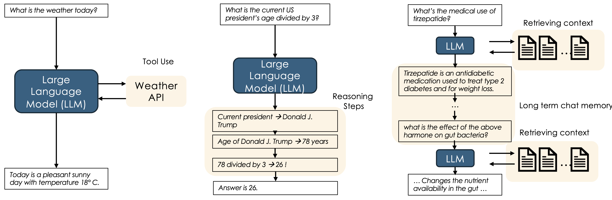

# Augmented LLMs (ALMs)
 
Naive LLMs can be significantly improved by augmenting them with external tools, memory, and reasoning capabilities. This allows them to perform complex tasks that require multi-step reasoning, access to external data, and the ability to remember past interactions.

- **Tool Use:** ALMs can call external tools — like **object detectors**, **search engines**, or **APIs** — to access accurate, up-to-date, or domain-specific information that goes beyond their static training data.

- **Reasoning:** They can break complex problems into logical subtasks using structured prompting (e.g., Chain-of-Thought), enabling more interpretable and dependable decision-making.

- **Memory:** Memory mechanisms allow ALMs to maintain and refer to long-term information — either from past interactions or retrieved knowledge — to stay coherent and solve persistence-based tasks.

As we will see later, for the lion's counting task, we can use an object detection model to count the lions in the image and thus enhance LLM's performance.

---

📚 **References**

1. Mialon et al., *Augmented Language Models: A Survey*, 2023.

---

## 🧭 What's Next?

Now that we’ve seen how LLMs can be enhanced with external abilities, let’s explore **LLM agents**.

[What are LLM Agents?](agentsintro)

---

## About the Author

**Kunal Gupta**  
[Website](https://kunalmgupta.github.io)  
[Email](mailto:k5gupta@ucsd.edu)  
[GitHub](https://github.com/KunalMGupta)
