# InteriorAgent: A Template for Building Agentic Generative AI

Now that we have learned the basics of LLM agents and how to build them, let us see what it takes to build one for a real problem.

In this section, we will study the case of my recent 3DV 2026 paper, **InteriorAgent: LLM Agent for Interior Design-Aware 3D Layout Generation**. I believe this project is a particularly useful case study for designing agentic systems because, much like Agent252D, it was built from scratch without relying on pre-existing LLM frameworks. At the time I started this project, there were no frameworks that worked well enough for what I wanted to do.

Through this case study, we will explore several key ideas in building agentic systems, including domain-effective representations, tool design, program synthesis, optimization, and most importantly, *context engineering*.

Let us begin.

## Problem

Consider the task of generating an interior layout from a user prompt such as *"a bedroom"*, optionally accompanied by a reference image. Our goal is to create a system that can predict the 4D pose of every asset in the scene: its position `(x, y, z)` and orientation.

For simplicity, let us assume that the assets have already been retrieved from a large repository of indoor objects.

<br>
<p style="text-align: center;">
  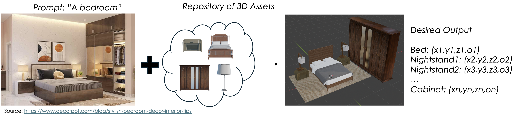
</p>
<br>

Creating high-quality interior layouts has many practical applications, including virtual reality, architectural visualization, and real estate planning. Generating realistic and functional indoor scenes requires both spatial reasoning and an understanding of human-centered design principles.

A common instinct is to treat this as a standard supervised learning problem: gather a large dataset of `(prompt, layout)` pairs and train the largest possible model on it.

<br>
<p style="text-align: center;">
  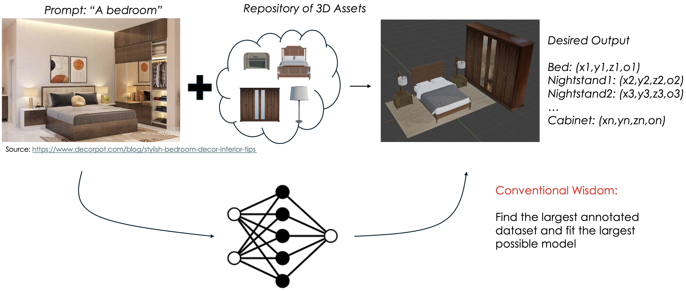
</p>
<br>

Unfortunately, this approach has several limitations:

1. Large, high-quality datasets of `(prompt, layout)` pairs are difficult to obtain. Many problems in 3D computer vision suffer from this data bottleneck.
2. Extending the system’s capabilities, for example by adding humans into the scene, often requires collecting a new dataset and retraining from scratch.
3. Editing is difficult to support unless one also has paired editing datasets, which are extremely rare.
4. Such systems do not naturally benefit from world knowledge. For example, they cannot easily generate a bedroom layout based on *"the latest design trends in 2026"*.

## Solution

We can instead leverage pretrained LLMs like GPT-5 to help compute the pose of all the assets.

A naive approach would be to feed the user prompt, along with asset information such as names, sizes, and images, directly into the LLM and ask it to output the final poses of all the assets.

<br>
<p style="text-align: center;">
  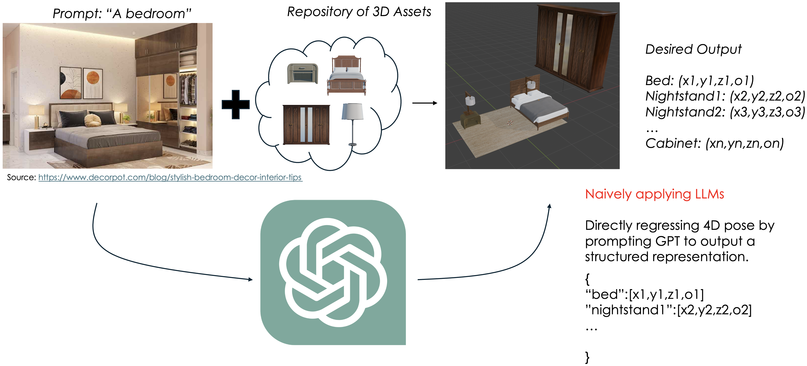
</p>
<br>

At first glance, this sounds reasonable. In practice, however, it does not work well.

The reason is that LLMs are primarily trained for discrete symbolic tasks such as translation, summarization, and coding. They are much less naturally suited for continuous, low-level tasks such as regression, which appear frequently in computer vision. Interior layout generation is one example. We could similarly imagine asking an LLM to regress 6-DoF bounding boxes for 3D object detection, or per-pixel depth maps from an image. That is clearly not the most natural interface.

This does **not** mean LLMs are unhelpful for computer vision. Rather, it suggests that they should not be asked to solve every subproblem directly. Instead, LLM-based agentic workflows should be combined with traditional computer vision pipelines and domain-specific tools. When used this way, they can help build systems that are both more capable and more flexible.

So, returning to the problem of interior design: how do we get accurate layouts from an LLM?

The answer is to give the model a *domain-specific API or language*.

Consider the following program:

```python
from IDSDL.scene import SceneProgRoom
scene = SceneProgRoom(“simple_bed_room”)

bed = scene.AddAsset(“a queen-sized bed with a wooden frame and a plush mattress”)
nightstand = scene.AddAsset(“a small wooden nightstand with a drawer”)
lamp = scene.AddAsset(“a modern table lamp with a white shade”)
rug = scene.AddAsset(“a soft neutral area rug”)
cabinet = scene.AddAsset(“a tall and wide wooden wardrobe with mirrored doors”)

nightstand.place_on_top(lamp)
bed.place_on_back_left(nightstand)
bed.place_on_back_right(nightstand)
bed.place_under(rug)
bed.place_on_right_further(cabinet)
```
Notice that the layout is represented as a program. Instead of directly listing the final poses of the objects, we specify relations between them. When the program executes, those relations are resolved into concrete poses.

This works because each high-level function is backed by grounded low-level logic. The LLM only needs to specify the high-level structure of the scene, while the low-level geometric reasoning is delegated to tools and domain-aware operations.

For example:
```python
@placemethod
def place_on_back_right(self, obj):
    front_dir, back_dir, left_dir, right_dir, center, width, height, depth = self.get_anchor_center_dirs()
    back_right = center + back_dir * (depth / 2 - obj.get_depth() / 2) + right_dir * (width / 2 + obj.get_width() / 2 + SIDE_GAP)
    obj.set_location(back_right[0], self.compute_obj_y(obj), back_right[2])
    obj.set_rotation(0)
    self.add_child(obj)
```
This illustrates a general principle: when solving computer vision problems using LLM agents, a great deal of thought should go into designing the right abstractions. These abstractions form the problem-specific *API/language* through which the LLM expresses its solution.

InteriorAgent uses a sophisticated **Interior Design-Aware Scene Description Language (IDSDL)** to express a wide variety of layouts. The following figure shows an example program for generating *"a living room with a toy pony"*.

<br>
<p style="text-align: center;">
  
</p>
<br>

The key benefit of such a language is that it allows the LLM to construct layouts without having to regress object poses directly. IDSDL is powerful not only because of its core interior-design logic, but also because it can invoke domain-specific tools for niche tasks, such as generating paintings using Stable Diffusion.

**Discussion:** How is this different from a standard tool-calling API? Why write programs instead of simply using JSON?

**Discussion:** You do not always need to create a custom API from scratch. There are many existing packages with strong Python APIs that can already serve as domain-specific toolkits. A few examples relevant to computer vision are:

1. CARLA — for creating large-scale scenes for autonomous driving.
2. Blender — for asset assembly, procedural materials, and scene generation through `bpy`.
3. Manim — for creating mathematical animations.
4. Open3D — for 3D data processing.

## Roadblock: How do we write programs using our API?

Creating a domain-specific language is a good first step. It gives the LLM a structured abstraction through which it can express solutions. But a major challenge remains:

How do we get the LLM to write correct and useful programs using an API it has never seen during training?

In particular, the model does not automatically know:

1. What the API looks like and what its capabilities and limitations are.
2. How to write syntactically and semantically correct programs that do not crash.
3. How to write programs that do something non-trivial and actually solve the task well.

This is where *context engineering* becomes central. No matter how strong vanilla LLMs become, these issues will remain fundamental in agentic workflows.

I believe these are still open-ended problems, and there is no single solution that works for every setting. But after working on such problems for several years, I can at least share the principles that I have found most useful.

## Lesson #1: Separate planning from programming

Any agentic workflow must solve two distinct problems:

1. It must reason about *what* should be done in order to solve the task well and align with the user intent.
2. It must correctly implement that plan using the domain-specific API.

In my experience, context engineering becomes much easier when reasoning and implementation are explicitly separated into different modules.

<br>
<p style="text-align: center;">
  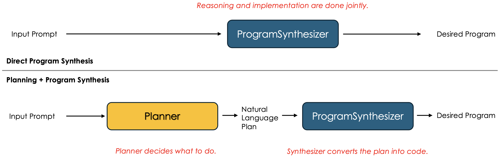
</p>
<br>

This separation allows us to provide different kinds of context to different modules. The planner only needs to understand the available tools and how they can help solve the task. The program synthesizer, on the other hand, needs detailed API information and examples of correct usage.

## Lesson #2: Use API documentation as context

If your API documentation is good enough to help a human write correct code, it is often also good enough to help an LLM do the same.

Good API documentation does not merely specify syntax. It also shows examples of intended usage.

In InteriorAgent, because I designed the language myself, I stored documentation directly in the API through attributes such as `description` and `examples`. This allowed IDSDL to automatically build its own documentation. We then combine the documentation for the entire API/language into one large string and provide it as context.

<br>
<p style="text-align: center;">
  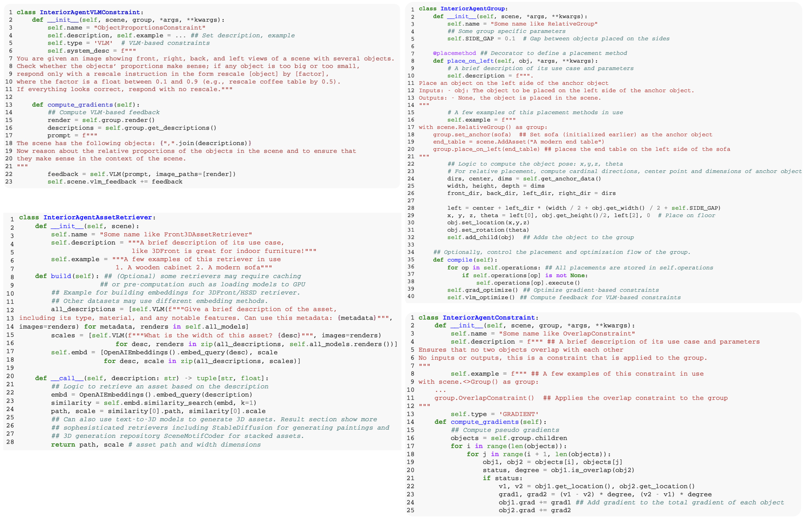
</p>
<br>

In this case, the documentation is stored in the system prompt, which makes it a form of short-term memory.

If your documentation is compact, this approach is perfectly reasonable. But in many real systems, documentation can be much larger. Consider something like `Blender`. In such cases, it is better to treat documentation as long-term memory, or better still, as a combination of short-term and long-term memory.

<br>
<p style="text-align: center;">
  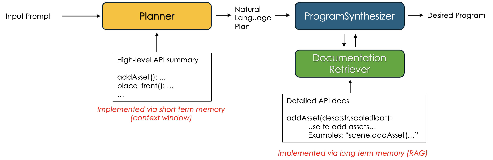
</p>
<br>

## Lesson #3: Better in-context examples beat carefully designed prompts

Instead of spending hours polishing prompts, it is often far more productive to design strong in-context examples.

For `ProgramSynthesizer` in InteriorAgent, the key challenge is to teach the model how to convert a natural language layout description from the planner into a valid program that correctly uses the API.

<br>
<p style="text-align: center;">
  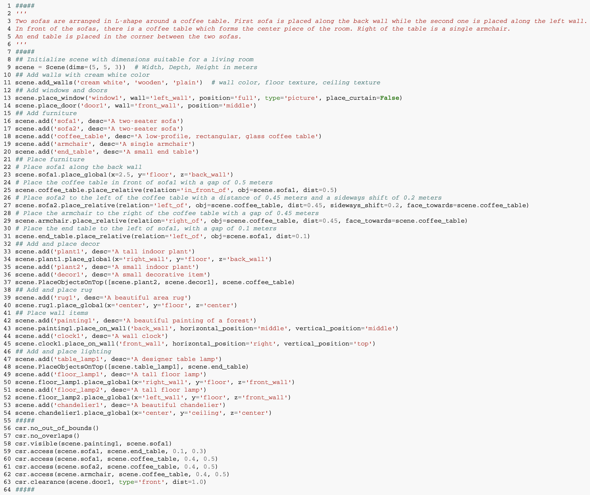
</p>
<br>

In general, the more diverse and representative your in-context examples are, the better your outputs will be. Ideally, these examples should also be stored using long-term memory, for example via RAG, so that the system can retrieve only the most relevant ones.

The following figure shows the implementation of `ProgramSynthesizer` in InteriorAgent.

<br>
<p style="text-align: center;">
  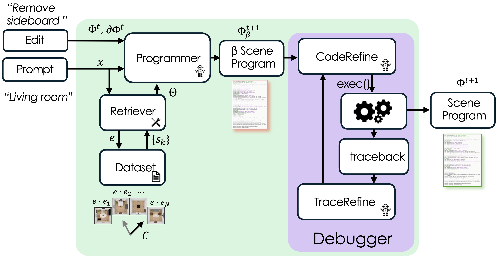
</p>
<br>

## Lesson #4: Agentic debugging

Because the pretrained LLM was not fine-tuned specifically for our domain-specific language, it will often generate programs with syntax or API-usage errors.

One way to handle this is through a simple debugging stack consisting of `CodeRefine` and `TraceRefine`. These are LLM modules prompted to reflect on the generated code, first to fix code structure and syntax, and then to inspect runtime errors after execution and refine the program using the resulting trace.

I have also released a package called [SceneProgSyn](https://github.com/KunalMGupta/SceneProgSyn) that encapsulates many of these ideas, and I encourage you to explore it.

If you do not want to implement a full agentic debugging system, a surprisingly effective alternative is to generate multiple programs and simply select the first one that executes successfully.

<br>
<p style="text-align: center;">
  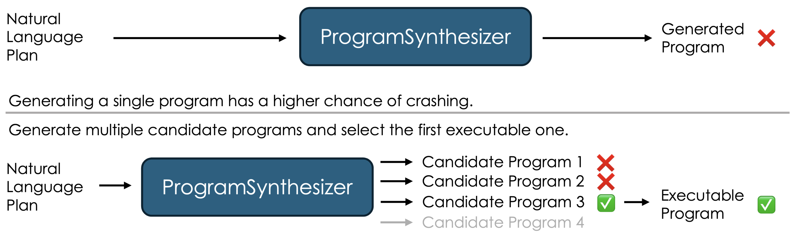
</p>
<br>

## Lesson #5: Iterative refinement

Even after a program is generated, it can often be improved further once we evaluate the resulting output.

The simplest refinement strategy is to ask the same LLM to critique its own output and improve it. This is the basic idea behind *Self-Refine*.

<br>
<p style="text-align: center;">
  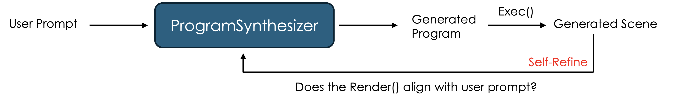
</p>
<br>

However, for grounded vision tasks, self-refinement alone can be unreliable. In my experience, it is more useful for improving *reasoning*, *planning*, and *summarization* than for improving tasks that require precise spatial understanding.

For InteriorAgent, we instead designed a variety of metrics that evaluate whether a generated scene respects interior design principles.

<br>
<p style="text-align: center;">
  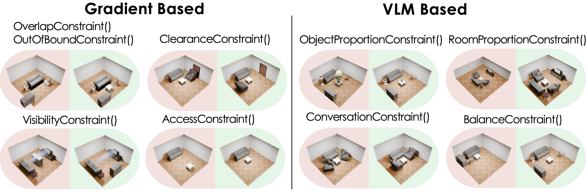
</p>
<br>

Importantly, there are two broad types of metrics:

1. Metrics that can be evaluated numerically, such as overlaps between objects.
2. Metrics that reflect overall scene quality or design coherence and are harder to compute directly, but may be judged reliably by a well-prompted VLM.

When designing an agentic workflow, it is important to ask which properties are best measured numerically and which can be judged robustly by a model.

Once the generated scene is evaluated, the applicable metrics are aggregated into a single feedback message that guides the next round of optimization.

<br>
<p style="text-align: center;">
  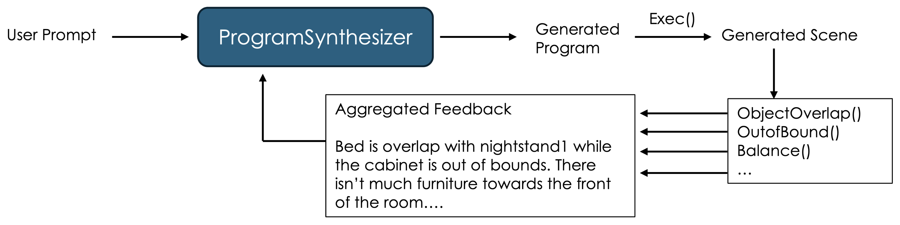
</p>
<br>

I like to think of these feedback signals as *pseudo-gradients* for `ProgramSynthesizer`. They do not optimize the program in a differentiable sense, but they do provide directional guidance for improving it.

In practice, this means that feedback should ideally be constructive and actionable. For example, instead of saying:

> “The bed and table are overlapping.”

it is often better to say:

> “The bed and table overlap. Move the bed 1 meter to the right to fix this.”

Suggestions like these are often derivable directly from the metrics themselves. They also help ground the refinement process and reduce the risk of hallucinated edits by `ProgramSynthesizer`.

Finally, just as robust program synthesis can benefit from generating multiple candidate programs and choosing the first valid one, optimization can also benefit from generating multiple candidate edits and choosing the one that aligns best with the user intent and evaluation signals.

<br>
<p style="text-align: center;">
  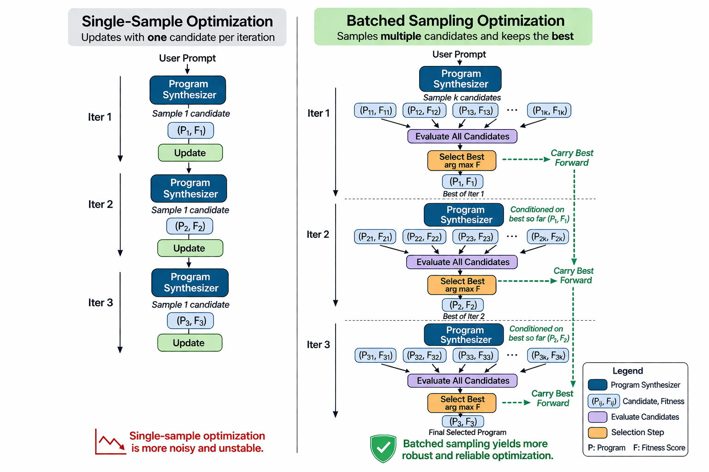
</p>
<br>

## Lesson #6: Give the planner tools and context for non-trivial results

Just as in-context examples and tool use can significantly improve `ProgramSynthesizer`, they can also improve the `Planner`.

A stronger planner can produce more creative, realistic, and task-aware plans. In the case of interior design, this could mean giving the planner access to blog posts from expert designers as in-context examples, or equipping it with tools specifically useful for 3D generation, such as text-to-room systems.

<br>
<p style="text-align: center;">
  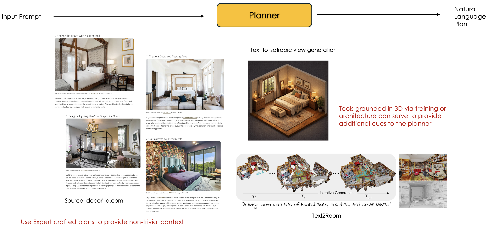
</p>
<br>