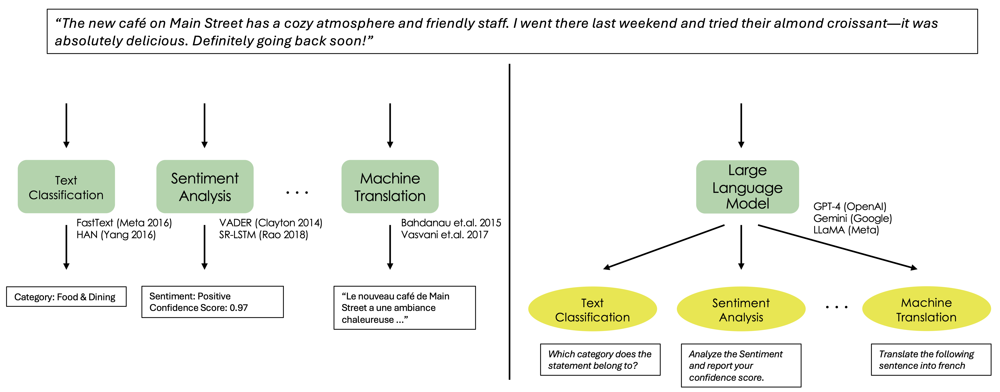

# Introduction to Large Language Models

Large Language models (LLMs) like GPT-4 are incredibly powerful, and have shown great performance across a range of NLP and vision tasks. Today, they can be used as a drop-in replacement to perform a multitude of tasks like text classification, sentiment analysis, machine translation, etc. For the scope of this tutorial, we shall refer to such LLMs as **Naive LLMs**. 

 
For this tutorial, we'll use a minimal LLM wrapper I built for my own projects, called [`sceneprogllm`](https://github.com/kunalmgupta/sceneprogllm). It provides intuitive access to models like GPT-4o, Ollama, and more — and you’re welcome to use it in your own projects!
Install it with:
```bash
pip install sceneprogllm
```
We’ll use GPT-4o (enabled by default). Make sure you have an OpenAI API key configured to run the examples below.
```python
from sceneprogllm import LLM
llm = LLM(name="text_bot", response_format="text")
response = llm("What is the capital of France?")
print(response)

# >> The capital of France is Paris.
```
---

## 🤖 Limitations of Naive LLMs
<br>
<p style="text-align: center;">
  
</p>

Let’s try some basic visual reasoning:

```python
response = llm("What animal is shown in this image?", image_paths=["assets/lions.png"])
print(response)

# >>The animals shown in the image are lions. 
```

Seems great! But now:

```python
response = llm("How many lions are there in this image?", image_paths=["assets/lions.png"])
print(response)

# >>There are seven lions in the image. 
```
**Oops!** There are clearly **six**, not seven.

This reveals common limitations of naive LLMs:

<ul>
  <li><span style="color: crimson;"><strong>Hallucination:</strong></span> Confidently returning factually incorrect answers.</li>
  <li><span style="color: crimson;"><strong>Lack of External Tools:</strong></span> No access to real-world utilities or APIs.</li>
  <li><span style="color: crimson;"><strong>Compositionality Gaps:</strong></span> Struggles with multi-step reasoning and counting.</li>
  <li><span style="color: crimson;"><strong>Scale Dependence:</strong></span> Capabilities only emerge at large parameter counts.</li>
  <li><span style="color: crimson;"><strong>Limited Context:</strong></span> Can’t process long or evolving sequences.</li>
  <li><span style="color: crimson;"><strong>Poor Interpretability:</strong></span> We don’t know how it arrived at the answer.</li>
</ul>

---

📚 **References**

1. Mialon et al., *Augmented Language Models: A Survey*, 2023.

---

## 🧭 What's Next?

In the next section, we’ll explore solving these issues with the help of **Augmented LLMs**. 

[What are Augmented LLMs?](augmentedllms)

---

## About the Author

**Kunal Gupta**  
[Website](https://kunalmgupta.github.io)  
[Email](mailto:k5gupta@ucsd.edu)  
[GitHub](https://github.com/KunalMGupta)
